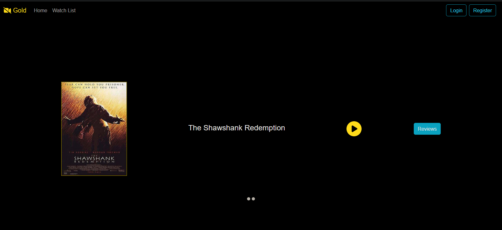
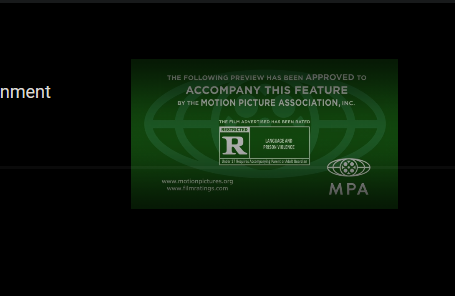
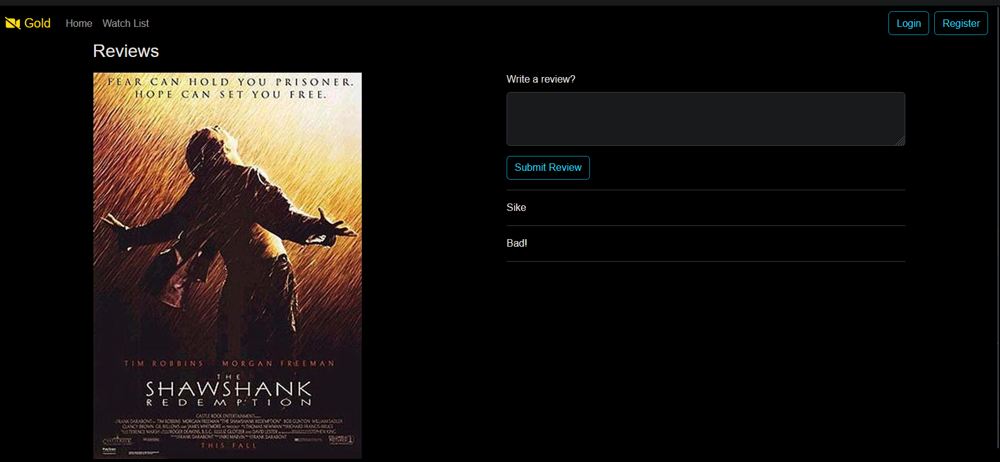

# Movie Application
This application is made using springboot and reactjs.
***

## Client 
Some client images of the application:

***

## Server
1. The application has two different endpoints for movie and review functionality
2. The movie end point can be accessed by going to `localhost:8080/{endpoint}` end point.
***

### Movie Endpoint
1. Movie end point has 2 end points to get the list of movies and other to get the details of single movie.
